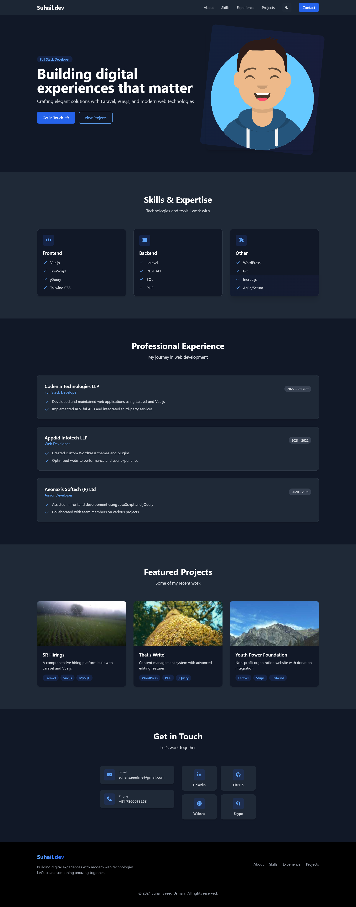

# Personal Portfolio Website

A modern, responsive portfolio website built with HTML, Tailwind CSS, and JavaScript. Features a clean design with dark mode support and smooth animations.



## Features

- 🌓 Dark/Light mode toggle with system preference detection
- 📱 Fully responsive design for all devices
- 🎨 Modern glassmorphism UI elements
- ⚡ Smooth animations and transitions
- 🎯 Interactive sections with hover effects
- 🔍 SEO-friendly structure
- 🎭 Accessible design with ARIA labels
- 🚀 Fast loading with optimized assets

## Technologies Used

- HTML5
- Tailwind CSS
- JavaScript (ES6+)
- Font Awesome Icons
- Google Fonts

## Sections

1. **Hero Section**
   - Professional introduction
   - Call-to-action buttons
   - Animated profile avatar

2. **Skills Section**
   - Frontend development skills
   - Backend development expertise
   - Other technical competencies

3. **Experience Section**
   - Professional timeline
   - Company details
   - Key responsibilities

4. **Projects Section**
   - Featured projects showcase
   - Project descriptions
   - Technology tags

5. **Contact Section**
   - Email contact
   - Phone number
   - Social media links
   - Professional profiles

## Setup and Installation

1. Clone the repository:
   ```bash
   git clone https://github.com/yourusername/portfolio.git
   ```

2. Navigate to the project directory:
   ```bash
   cd portfolio
   ```

3. Open `index.html` in your browser or use a local server:
   ```bash
   # Using Python
   python -m http.server 8000

   # Using Node.js
   npx serve
   ```

## Customization

1. **Content**: Edit the `index.html` file to update text and information
2. **Styling**: Modify Tailwind classes or add custom CSS
3. **Images**: Replace images in the `storage` directory
4. **Colors**: Update the color scheme in the Tailwind config
5. **Dark Mode**: Customize dark mode colors in the theme configuration

## Performance Optimization

- Lazy loading for images
- Minified CSS with Tailwind
- Optimized Font Awesome loading
- Smooth scrolling implementation
- Efficient dark mode toggle

## Browser Support

- Chrome (latest)
- Firefox (latest)
- Safari (latest)
- Edge (latest)
- Opera (latest)

## Contributing

1. Fork the repository
2. Create your feature branch (`git checkout -b feature/AmazingFeature`)
3. Commit your changes (`git commit -m 'Add some AmazingFeature'`)
4. Push to the branch (`git push origin feature/AmazingFeature`)
5. Open a Pull Request

## License

This project is licensed under the MIT License - see the [LICENSE](LICENSE) file for details.

## Contact

Suhail Saeed Usmani - [suhailsaeedme@gmail.com](mailto:suhailsaeedme@gmail.com)

Project Link: [https://github.com/mrdevil786/My-Portfolio](https://github.com/mrdevil786/My-Portfolio)

## Acknowledgments

- [Tailwind CSS](https://tailwindcss.com/)
- [Font Awesome](https://fontawesome.com/)
- [Google Fonts](https://fonts.google.com/)
- [Avataaars](https://getavataaars.com/) 